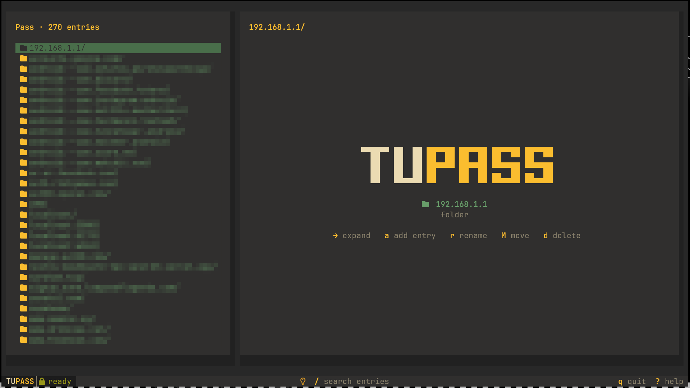
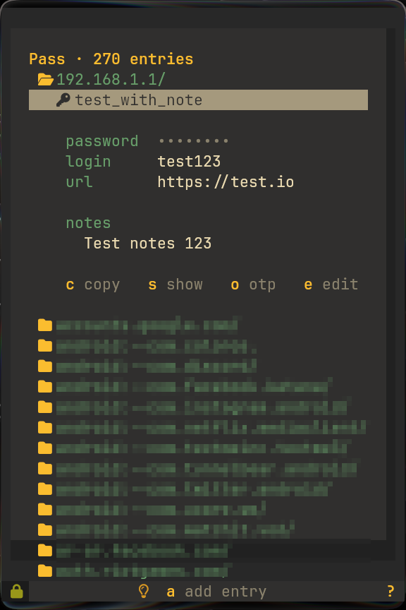

# tupass

A fast, keyboard-driven terminal UI for [GNU `pass`](https://www.passwordstore.org/) - the standard unix password manager - built with [OpenTUI](https://github.com/sst/opentui) and React.

Browse your store as a collapsible tree, decrypt on demand, copy to the clipboard (auto-clearing), generate passwords, manage OTP codes, and rename/move/duplicate entries - all without leaving the terminal. It themes itself from your terminal palette and ships a dozen bundled color schemes with a live picker.



<p align="center">
  
  <br>
  <sub>Narrow terminals collapse to a single column with inline detail.</sub>
</p>

## Features

- **Tree browser** - collapsible folders, windowed for large stores, fuzzy filter (`/`).
- **Lazy decryption** - entries are only decrypted when you open them; the rest is instant.
- **Clipboard** - copy the password or a specific field via `pass -c` (auto-clears after 45s).
- **OTP** - generate TOTP codes for entries (requires the `pass-otp` extension).
- **Full CRUD** - add, edit, generate, rename (in place), move (folder picker), duplicate, delete.
- **Git** - one-key sync (`pull --rebase` + `push`) and recent-log view for git-backed stores.
- **Theming** - auto-detects your terminal colors, plus bundled schemes (Catppuccin, Dracula, Tokyo Night, Nord, Gruvbox, Rosé Pine, Kanagawa, Everforest, Solarized, GitHub Light…) switchable live with `t`. Your choice persists.
- **Responsive** - side preview pane on wide terminals; on narrow ones it collapses to a single-column list with each entry's details expanding inline.

## Requirements

- [Bun](https://bun.com) (runtime + package manager)
- [`pass`](https://www.passwordstore.org/) with an initialized store (`pass init <gpg-id>`)
- `gpg` + `gpg-agent` - a **graphical pinentry** (gtk/qt/gnome) is recommended; a TTY pinentry can conflict with the full-screen UI on first unlock
- Optional: the [`pass-otp`](https://github.com/tadfisher/pass-otp) extension for OTP codes
- A terminal with **truecolor** and a **[Nerd Font](https://www.nerdfonts.com/)** (icons + glyphs)

## Install

tupass runs on **Bun** - OpenTUI uses `bun:ffi` for its native renderer, so Node is not supported. The `tupass` command is a tiny launcher that runs on your installed Bun; no runtime is bundled.

Install globally from npm (Bun fetches the right native renderer for your platform):

```bash
bun add -g tupass
```

Then just run:

```bash
tupass
```

### From source

```bash
git clone https://github.com/d7omdev/tupass
cd tupass
bun install
bun link          # puts `tupass` on your PATH (runs via your Bun)
# or run without linking:
bun run dev
```

If no store exists at `~/.password-store`, tupass exits with instructions to run `pass init`.

### Desktop entry

A launcher and lock icon live in [`docs/`](docs). Install them to get a `tupass`
app entry (opens in a dedicated kitty window with `WM_CLASS=Tupass`):

```bash
install -Dm644 docs/tupass.svg ~/.local/share/icons/hicolor/scalable/apps/tupass.svg
install -Dm644 docs/tupass.desktop ~/.local/share/applications/tupass.desktop
update-desktop-database ~/.local/share/applications 2>/dev/null || true
gtk-update-icon-cache ~/.local/share/icons/hicolor 2>/dev/null || true
```

Or just launch it directly:

```bash
kitty --class Tupass --title tupass tupass
```

## Keybindings

| Key | Action |
|-----|--------|
| `↑ ↓` / `j k` | move selection |
| `→` / `l` / `space` | expand folder · open entry |
| `←` / `h` | collapse folder · jump to parent |
| `enter` | open entry (decrypt) / toggle folder |
| `s` | reveal / hide password |
| `c` | copy password to clipboard (auto-clears) |
| `C` | copy a specific field (login/url…) |
| `o` | generate & copy OTP code |
| `a` / `n` | add entry inside the current folder · `A` adds at the root |
| `g` | generate a password |
| `e` | edit entry |
| `r` | rename file/folder in place (folder locked) |
| `M` | move to another folder (pick or create) |
| `p` | duplicate entry |
| `d` | delete entry |
| `/` | fuzzy filter |
| `t` | switch color theme (live preview) |
| `E` / `W` | expand all / collapse all |
| `G` / `L` | git sync / git log |
| `?` | toggle help |
| `q` / `Ctrl+C` | quit |

## Configuration

| Variable | Purpose |
|----------|---------|
| `PASSWORD_STORE_DIR` | location of the store (default `~/.password-store`) |
| `PASSWORD_STORE_CLIP_TIME` | clipboard auto-clear seconds (honored by `pass`, default 45) |
| `TUPASS_NO_OSC` | set to disable terminal-palette detection (for terminals that leak the OSC reply) |

The selected theme is saved to `~/.config/tupass/config.json` (honors `XDG_CONFIG_HOME`).

## Development

```bash
bun run validate   # typecheck + lint
bun run typecheck
bun run lint
```

## Security

tupass never sees your passphrase - decryption is delegated to `gpg`/`gpg-agent`, and all entry names are passed as discrete argv (never interpolated into a shell), so a name like `$(rm -rf ~)` is inert.
